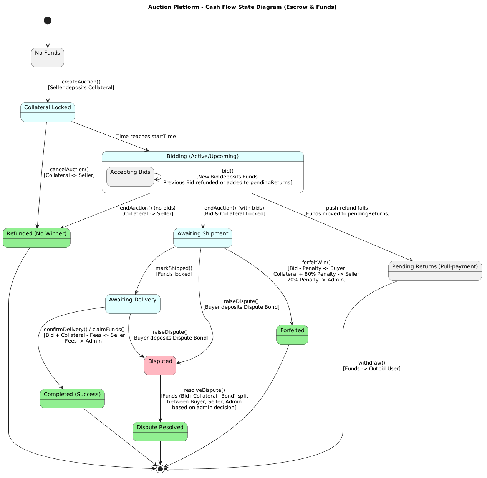
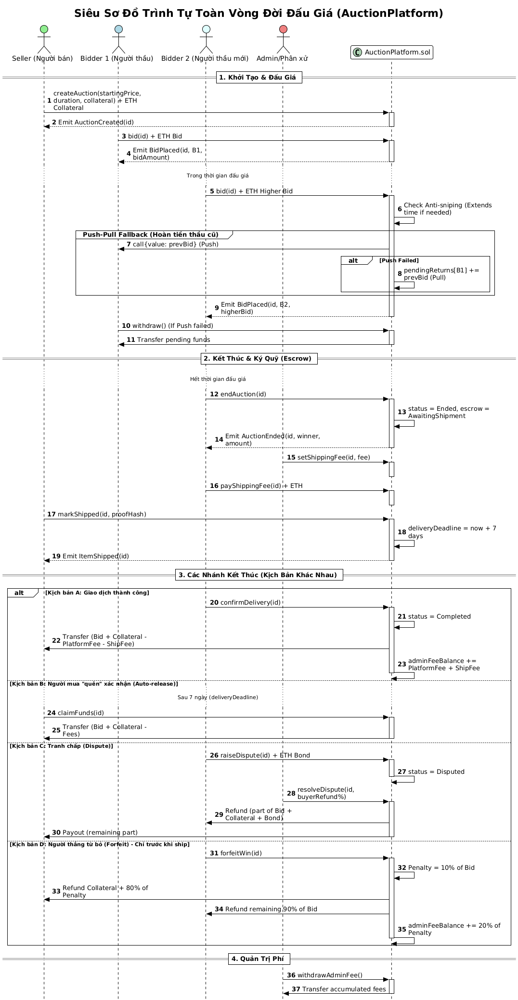
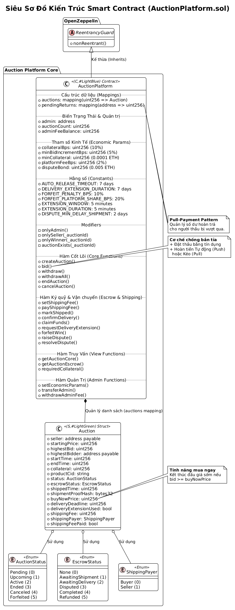
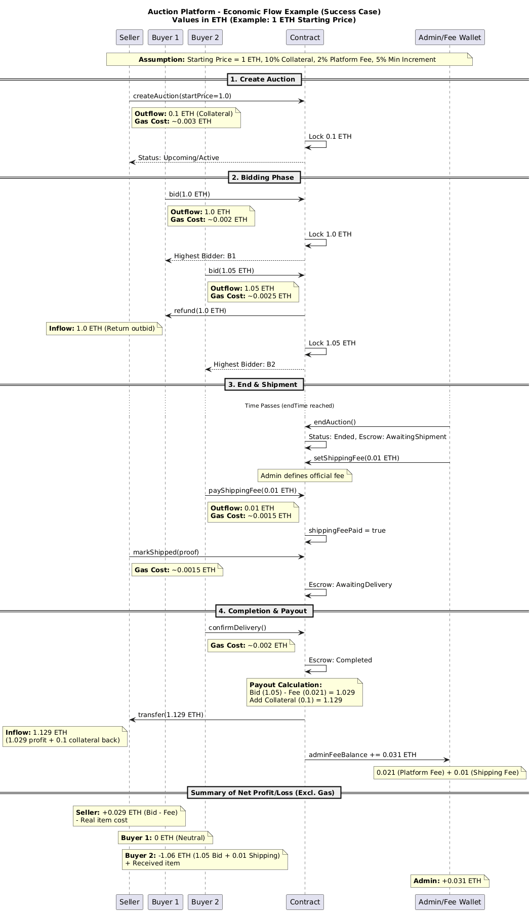

# Đặc Tả Kỹ Thuật & Nghiệp Vụ Hệ Thống Biddee

Dự án này là một nền tảng Đấu giá C2C (Consumer-to-Consumer) phi tập trung toàn diện, kết hợp sức mạnh của Smart Contract với sự linh hoạt của kiến trúc Web2.5. Tài liệu này mô tả chi tiết các cơ chế vận hành, tham số kinh tế và kiến trúc hệ thống.

---

## 1. Mục Tiêu & Giải Pháp (Vision & Mission)

### 1.1. Vấn đề của Đấu giá C2C Truyền thống
- **Thiếu niềm tin**: Người bán sợ không nhận được tiền, người mua sợ nhận hàng kém chất lượng.
- **Thầu ảo (Ghost Bidding)**: Người bán tự đẩy giá món hàng.
- **Bỏ thầu**: Người thắng không thanh toán, gây lãng phí thời gian.

### 1.2. Giải pháp của Biddee
- **Ký quỹ Minh bạch (Escrow)**: Tiền thầu được khóa trong Smart Contract.
- **Tiền cọc Người bán (Seller Collateral)**: Cam kết giao hàng đúng mô tả.
- **Xác thực Ví (SIWE)**: Định danh duy nhất qua địa chỉ ví.

---

## 2. Đặc Tả Nghiệp Vụ Chi Tiết (Business Specification)

### 2.1. Quy trình Đấu giá (Auction Lifecycle)
Mô tả trình tự tương tác giữa Người bán, Người mua, Admin và Smart Contract.

*[Xem file thiết kế: res/AuctionPlatform_FullSequence_VN.puml]*

- **Tạo đấu giá**: Người bán nạp `Collateral` (mặc định 10%).
- **Cơ chế Đặt thầu**: Bước giá tối thiểu 5% (`minBidIncrementBps`).
- **Chống bắn tỉa (Anti-sniping)**: Gia hạn 5 phút nếu có thầu vào phút chót.

### 2.2. Cơ chế Ký quỹ & Vận chuyển (Escrow & Logistics)
Theo dõi cách tiền cọc và tiền thầu di chuyển qua các trạng thái ký quỹ.

*[Xem file thiết kế: res/AuctionPlatform_CashFlowState_VN.puml]*

- **Xác nhận giao hàng**: Người bán gọi `markShipped` kèm bằng chứng.
- **Giải ngân tự động**: Sau 7 ngày (`AUTO_RELEASE_TIMEOUT`) nếu không có khiếu nại.

---

## 3. Ngăn Xếp Công Nghệ (Technical Stack)

Dự án áp dụng mô hình **Hybrid Web3 Architecture**:

| Lớp (Layer) | Công nghệ | Chi tiết |
| :--- | :--- | :--- |
| **Blockchain** | Solidity 0.8.28, Hardhat | [Xem chi tiết Stack Blockchain](res/Blockchain_Stack_Overview_VN.md) |
| **Backend** | Node.js, Express v5, Prisma | [Xem chi tiết Stack Backend](res/Backend_Stack_Overview_VN.md) |
| **Frontend** | Next.js 16, React 19, Tailwind 4 | [Xem chi tiết Stack Frontend](res/Frontend_Stack_Overview_VN.md) |

---

## 4. Tham Số Kinh Tế (Economic Parameters)

| Tham số | Giá trị | Ý nghĩa |
| :--- | :--- | :--- |
| **Collateral Bps** | 1000 (10%) | Tỷ lệ tiền cọc tối thiểu người bán phải nạp |
| **Platform Fee** | 200 (2%) | Phí nền tảng thu trên mỗi giao dịch thành công |
| **Forfeit Penalty** | 10% (giá thầu) | Tiền phạt nếu người thắng từ bỏ món hàng |
| **Penalty Split** | 80/20 | 80% phạt trả người bán, 20% trả nền tảng |
| **Dispute Bond** | 0.005 ETH | Tiền ký quỹ để mở một vụ tranh chấp |

---

## 5. Thiết Kế Dữ Liệu & Luồng Kinh Tế Thực Tế

### 5.1. Cơ sở dữ liệu (Database ERD)
Hệ thống quản lý 14 thực thể chính, ánh xạ trực tiếp từ Smart Contract sang PostgreSQL.

*[Xem file thiết kế: res/AuctionPlatform_Database_ERD.puml]*
- [Đặc tả chi tiết DB](res/Database_ERD_Overview_VN.md)

### 5.2. Ví dụ Luồng Kinh tế (Economic Flow)
Minh họa cụ thể luồng tiền ra/vào với mức giá 1 ETH.

*[Xem file thiết kế: res/AuctionPlatform_EconomicFlow_Example_VN.puml]*

---

## 6. Danh Mục Tài Nguyên (Artifacts Map)

Tất cả các tài liệu chi tiết được lưu trữ trong thư mục `res/`:

- **Nghiệp vụ**: [Blockchain](res/Blockchain_Business_Overview_VN.md) | [Backend](res/Backend_Business_Overview_VN.md) | [Frontend](res/Frontend_Business_Overview_VN.md)
- **Kỹ thuật**: [Blockchain Stack](res/Blockchain_Stack_Overview_VN.md) | [Backend Stack](res/Backend_Stack_Overview_VN.md) | [Frontend Stack](res/Frontend_Stack_Overview_VN.md)
- **Database**: [ERD Overview](res/Database_ERD_Overview_VN.md)

---
*Tài liệu này là bản đặc tả chính thức của hệ thống Biddee.*
