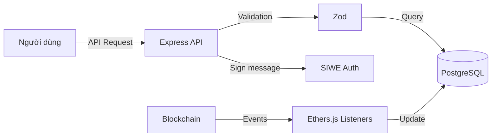

# Tổng Quan Chi Tiết Backend Stack - Dự Án Biddee

Tài liệu này mô tả chi tiết về ngăn xếp công nghệ (stack), vai trò và lý do sử dụng các công cụ trong phần Backend của nền tảng đấu giá.

---

## 1. Bản Đồ Vai Trò Các Thành Phần (Backend Stack Overview)

| Thành phần | Công nghệ | Vai trò chính |
| :--- | :--- | :--- |
| **Runtime** | Node.js (TypeScript) | Môi trường thực thi mã nguồn phía máy chủ |
| **Framework API** | Express.js (v5) | Xây dựng các API RESTful để kết nối Frontend và Database |
| **ORM** | Prisma | Quản lý truy vấn và cấu trúc cơ sở dữ liệu một cách Type-safe |
| **Cơ sở dữ liệu** | PostgreSQL | Lưu trữ dữ liệu metadata, lịch sử, người dùng và tin nhắn |
| **Xác thực (Auth)** | SIWE & JWT | Đăng nhập bằng ví Ethereum và quản lý phiên làm việc |
| **Blockchain Sync** | Ethers.js (v6) | Lắng nghe sự kiện từ Smart Contract để đồng bộ Database |
| **Kiểm tra dữ liệu** | Zod | Đảm bảo tính hợp lệ của dữ liệu đầu vào (Schema validation) |
| **Kiểm thử** | Vitest | Chạy các bản kiểm thử đơn vị và tích hợp |

---

## 2. Chi Tiết Các Công Nghệ Trọng Yếu

### A. Express.js (v5) & TypeScript
- **Lý do**: Express là framework phổ biến nhất cho Node.js, đơn giản và linh hoạt. TypeScript giúp quản lý các cấu trúc dữ liệu phức tạp của đấu giá mà không lo lỗi kiểu dữ liệu.
- **Vai trò**: Định nghĩa các route API cho người dùng, xử lý logic nghiệp vụ off-chain và trả về dữ liệu cho Frontend.

### B. Prisma & PostgreSQL
- **Lý do**: PostgreSQL là cơ sở dữ liệu quan hệ mạnh mẽ, hỗ trợ tốt dữ liệu JSON. Prisma giúp tương tác với DB qua code TypeScript một cách mượt mà.
- **Vai trò**: Lưu trữ thông tin chi tiết về món hàng (mà on-chain không lưu vì đắt), hồ sơ người dùng, thông báo và lịch sử chat.

### C. SIWE (Sign-In with Ethereum)
- **Lý do**: Thay vì dùng email/mật khẩu truyền thống, dự án dùng ví blockchain để định danh, tăng tính bảo mật và nhất quán với lớp Blockchain.
- **Vai trò**: Người dùng ký một thông điệp bằng ví của họ để chứng minh quyền sở hữu địa chỉ ví, Backend xác thực và cấp mã JWT.

### D. Ethers.js Listeners
- **Lý do**: Khi có một sự kiện xảy ra trên chuỗi (ví dụ: có người đặt thầu), Backend cần biết để cập nhật dữ liệu và gửi thông báo.
- **Vai trò**: Chạy các dịch vụ ngầm lắng nghe `AuctionCreated`, `BidPlaced`, `ItemShipped`... từ contract để cập nhật trạng thái trong PostgreSQL.

### E. Zod (Validation)
- **Lý do**: Ngăn chặn dữ liệu rác hoặc mã độc tấn công API.
- **Vai trò**: Kiểm tra mọi dữ liệu gửi lên từ Frontend (như tiêu đề đấu giá, số tiền, nội dung chat) phải đúng định dạng trước khi xử lý.

---

## 3. Luồng Dữ Liệu Tổng Quát

---

## 4. Các Công cụ Hỗ trợ Khác
- **Pino**: Ghi log hệ thống với hiệu suất cực cao.
- **Multer & Sharp**: Xử lý tải ảnh lên và tối ưu hóa kích thước ảnh (avatar, ảnh sản phẩm).
- **Helmet**: Bảo mật các HTTP headers.
- **Vitest**: Framework kiểm thử hiện đại, nhanh hơn Jest.
