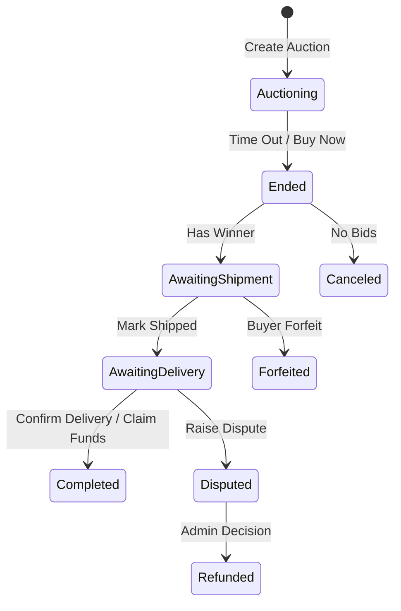

# Tổng Quan Nghiệp Vụ Blockchain - Dự Án Biddee

Tài liệu này mô tả các quy trình nghiệp vụ, cơ chế vận hành tài chính và các chính sách quản lý giao dịch được thực thi bởi Smart Contract trên Blockchain.

---

## 1. Mô Hình Nghiệp Vụ Cốt Lõi (Core Business Model)

Nền tảng hoạt động theo mô hình **Đấu giá C2C (Consumer-to-Consumer)** kết hợp với **Hệ thống Ký quỹ (Escrow) dựa trên Tiền cọc (Collateral)**. Mục tiêu chính là xây dựng niềm tin giữa những người lạ trong môi trường phi tập trung.

### A. Quy trình Đấu giá
1. **Khởi tạo**: Người bán đặt giá khởi điểm, thời gian kết thúc và nạp tiền cọc (Collateral) để cam kết thực hiện giao dịch.
2. **Đấu giá**: Người mua đặt thầu (Bid). Tiền thầu được khóa trong hợp đồng. Nếu có người trả giá cao hơn, người thầu cũ sẽ được hoàn tiền ngay lập tức (Push) hoặc lưu vào số dư chờ rút (Pull).
3. **Mua ngay (Buy Now)**: Nếu người bán cấu hình giá mua ngay, phiên đấu giá sẽ kết thúc lập tức khi có người trả mức giá này.

### B. Cơ chế Chống bắn tỉa (Anti-sniping)
Để đảm bảo công bằng, nếu có lệnh thầu được đưa ra trong 5 phút cuối cùng, thời gian đấu giá sẽ tự động gia hạn thêm 5 phút. Điều này ngăn chặn việc "cướp" món hàng ở giây cuối cùng mà không cho người khác cơ hội phản hồi.

---

## 2. Cơ chế Ký quỹ & Dòng tiền (Escrow & Cash Flow)

Dòng tiền trong hệ thống được quản lý chặt chẽ qua các giai đoạn của hợp đồng ký quỹ:

| Giai đoạn | Hành động tài chính | Trạng thái tiền |
| :--- | :--- | :--- |
| **Bắt đầu** | Người bán nạp cọc | Cọc bị khóa (Collateral Locked) |
| **Đấu giá** | Người mua nạp Bid | Bid bị khóa, trả Bid cũ |
| **Kết thúc** | Xác định người thắng | Cọc + Bid bị khóa chờ giao hàng |
| **Giao hàng** | Người mua xác nhận | Giải ngân cho Người bán (sau khi trừ phí) |
| **Hủy bỏ** | Không có ai thầu | Trả cọc cho Người bán |

---

## 3. Quản lý Rủi ro & Tranh chấp (Risk & Dispute Management)

Hệ thống thiết lập các rào cản tài chính để ngăn chặn hành vi xấu từ cả hai phía:

### A. Đối với Người bán (Chống lừa đảo không giao hàng)
- **Tiền cọc (Collateral)**: Nếu người bán không giao hàng hoặc giao hàng sai, họ sẽ mất một phần hoặc toàn bộ tiền cọc khi tranh chấp xảy ra.
- **Thời hạn giao hàng**: Nếu người mua không xác nhận sau 7 ngày kể từ khi ship, người bán mới có quyền tự rút tiền (Auto-release).

### B. Đối với Người mua (Chống thầu ảo/bỏ thầu)
- **Hình phạt Từ bỏ (Forfeit)**: Người thắng cuộc có quyền từ bỏ món hàng trước khi người bán giao đi, nhưng sẽ bị phạt **10% giá thầu**. Số tiền phạt này được chia cho Người bán (80%) và Nền tảng (20%).
- **Ký quỹ Tranh chấp (Dispute Bond)**: Để tránh tranh chấp vô căn cứ, người mua phải nạp một khoản phí phân xử khi mở tranh chấp. Nếu họ thắng, tiền này được trả lại.

---

## 4. Chính sách Tài chính & Phí (Economic Policies)

Smart Contract tự động thực thi các thông số kinh tế sau:
- **Tiền cọc tối thiểu**: 0.0001 ETH hoặc 10% giá khởi điểm (tùy giá trị nào lớn hơn).
- **Bước giá tối thiểu**: 5% giá thầu hiện tại.
- **Phí nền tảng**: 2% trên tổng giá trị giao dịch thành công.
- **Phí vận chuyển**: Được Admin hoặc đơn vị vận chuyển xác nhận và khóa vào hợp đồng trước khi ship.

---

## 5. Quy trình Phân xử (Dispute Resolution)

Khi có tranh chấp, Admin (hoặc hội đồng phân xử) sẽ đánh giá bằng chứng và ra quyết định:
1. **Hoàn tiền 100% cho Người mua**: Nếu hàng lỗi nặng hoặc không giao. Người bán mất cọc.
2. **Thanh toán 100% cho Người bán**: Nếu Người mua khiếu nại sai. Người mua mất phí phân xử.
3. **Phân chia theo tỷ lệ**: Tùy mức độ hư hại của hàng hóa, Admin có thể quyết định chia lại tỷ lệ hoàn tiền.

---

## 6. Sơ đồ Tóm tắt Nghiệp vụ (Business Lifecycle)

