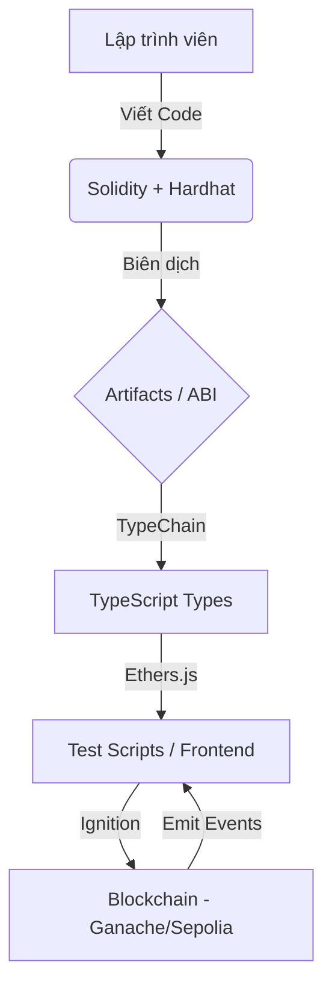

# Tổng Quan Chi Tiết Blockchain Stack - Dự Án Biddee

Tài liệu này cung cấp cái nhìn sâu sắc về các thành phần công nghệ (stack), vai trò cụ thể và lý do lựa chọn chúng trong việc xây dựng lớp Blockchain cho nền tảng đấu giá C2C.

---

## 1. Bản Đồ Vai Trò Các Thành Phần (Stack Overview)

| Thành phần | Công nghệ | Vai trò chính | Tầm quan trọng |
| :--- | :--- | :--- | :--- |
| **Ngôn ngữ** | Solidity 0.8.28 | Lập trình logic nghiệp vụ Smart Contract | Trái tim của hệ thống, xử lý tiền và niềm tin |
| **Khung phát triển** | Hardhat | Quản lý vòng đời phát triển (biên dịch, test, deploy) | Tăng tốc độ phát triển và giảm thiểu lỗi |
| **Thư viện chuẩn** | OpenZeppelin | Cung cấp các mẫu bảo mật và cấu trúc chuẩn | Đảm bảo an toàn tài sản và chống tấn công phổ biến |
| **Giao tiếp** | Ethers.js v6 | Kết nối mã nguồn TypeScript với Blockchain | Cầu nối giữa logic ngoài chuỗi và trong chuỗi |
| **Kiểu dữ liệu** | TypeChain | Tạo kiểu dữ liệu TypeScript từ Smart Contract | Đảm bảo code không lỗi khi gọi hàm contract |
| **Triển khai** | Hardhat Ignition | Hệ thống quản lý deployment theo module | Giúp triển khai chuyên nghiệp, dễ khôi phục khi lỗi |

---

## 2. Chi Tiết Từng Thành Phần

### A. Solidity (v0.8.28)
- **Định nghĩa**: Là ngôn ngữ lập trình hướng đối tượng, cấp cao, được thiết kế riêng để xây dựng Smart Contract trên Ethereum Virtual Machine (EVM).
- **Vai trò trong dự án**: 
    - Thực thi logic đấu giá (đặt thầu, gia hạn thời gian, xác định người thắng).
    - Quản lý cơ chế ký quỹ (Escrow) và phân chia tài chính.
- **Tính năng đặc biệt**:
    - `viaIR`: Chuyển đổi mã nguồn sang mã trung gian Yul trước khi biên dịch ra Bytecode, giúp tối ưu hóa bộ nhớ và tránh lỗi "Stack too deep".
    - `Optimizer`: Chạy 200 lần để cân bằng giữa chi phí deploy và chi phí thực thi giao dịch.

### B. Hardhat (v2.22.0)
- **Định nghĩa**: Là một môi trường phát triển (Development Environment) giúp các nhà phát triển Ethereum tự động hóa các tác vụ lặp đi lặp lại.
- **Vai trò trong dự án**:
    - **Máy ảo cục bộ**: Cung cấp mạng Hardhat Network để chạy test ngay lập tức.
    - **Console & Debugging**: Cho phép `console.log` ngay trong code Solidity để gỡ lỗi nhanh.
    - **Plugin Ecosystem**: Tích hợp các công cụ báo cáo gas và độ phủ mã nguồn.

### C. OpenZeppelin Contracts (v5.0.0)
- **Định nghĩa**: Là thư viện mã nguồn mở phổ biến nhất thế giới dành cho phát triển Smart Contract an toàn.
- **Vai trò trong dự án**:
    - `ReentrancyGuard`: Ngăn chặn các cuộc tấn công "rút tiền lặp lại" (tấn công DAO nổi tiếng).
    - Cung cấp các tiêu chuẩn bảo mật đã được kiểm duyệt (Audited) bởi cộng đồng.

### D. Ethers.js (v6)
- **Định nghĩa**: Là một thư viện JavaScript hoàn chỉnh và nhỏ gọn để tương tác với Hệ sinh thái Ethereum.
- **Vai trò trong dự án**:
    - Chuyển đổi dữ liệu từ người dùng (ETH) sang định dạng BigInt mà Blockchain hiểu được.
    - Ký và gửi các giao dịch lên mạng lưới.
    - Lắng nghe các sự kiện (Events) phát ra từ Smart Contract để cập nhật giao diện người dùng.

### E. TypeChain
- **Định nghĩa**: Công cụ tự động tạo ra các tệp định nghĩa kiểu (.d.ts) cho TypeScript dựa trên ABI của Smart Contract.
- **Vai trò trong dự án**:
    - Giúp lập trình viên biết chính xác hàm nào có tồn tại, tham số truyền vào là gì mà không cần mở file `.sol`.
    - Phát hiện lỗi sai kiểu dữ liệu ngay tại thời điểm viết code (Compile-time error).

### F. Hardhat Ignition
- **Định nghĩa**: Là một hệ thống triển khai mang tính "khai báo" (declarative), tập trung vào kết quả cuối cùng mong muốn.
- **Vai trò trong dự án**:
    - Thay thế các script deploy thủ công rườm rà bằng các "Module".
    - Tự động tính toán các phụ thuộc giữa các contract.
    - Lưu lại trạng thái triển khai, nếu mạng lỗi giữa chừng, Ignition sẽ chỉ chạy tiếp phần còn thiếu khi chạy lại.

---

## 3. Trực Quan Hóa Luồng Hoạt Động

---

## 4. Các Môi Trường Mạng (Networks)

1. **Hardhat Network (Internal)**: 
    - *Đặc điểm*: Tồn tại trong bộ nhớ, tự hủy khi xong việc.
    - *Mục đích*: Unit Test cực nhanh.
2. **Ganache (External Local)**:
    - *Đặc điểm*: Có giao diện UI, địa chỉ ví cố định, giao dịch được lưu lại.
    - *Mục đích*: Phát triển Frontend và kiểm tra tích hợp.
3. **Sepolia (Public Testnet)**:
    - *Đặc điểm*: Mạng thật, tiền ảo (Faucet).
    - *Mục đích*: Kiểm tra cuối cùng trước khi triển khai thực tế.
