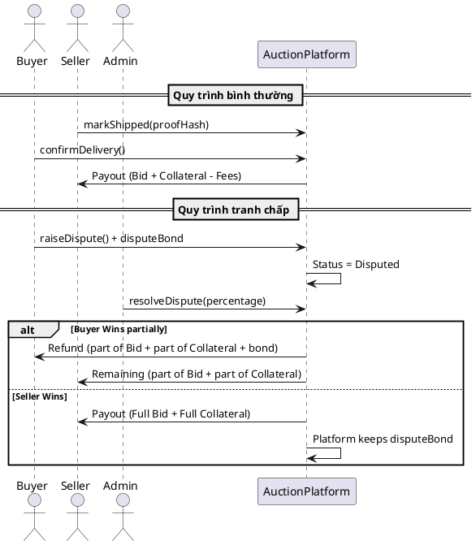

# Giải Trình Cơ Chế Hoạt Động Của Smart Contract (AuctionPlatform)

Tài liệu này cung cấp cái nhìn chi tiết về các cơ chế nghiệp vụ được thực thi bởi Smart Contract `AuctionPlatform.sol` trong hệ thống đấu giá C2C.

---

## 1. Tổng Quan (Overview)

Smart Contract `AuctionPlatform` đóng vai trò là một bên trung gian đáng tin cậy (escrow) xử lý toàn bộ vòng đời của một cuộc đấu giá và quá trình vận chuyển hàng hóa sau đó.

### Mục tiêu cốt lõi:
- **Tự động hóa**: Thực thi các quy tắc đấu giá mà không cần can thiệp thủ công.
- **Bảo vệ tài chính**: Giữ tiền thầu trong tài khoản trung gian (escrow) cho đến khi giao hàng thành công.
- **Chống gian lận**: Yêu cầu người bán thế chấp (collateral) để đảm bảo trách nhiệm giao hàng.
- **Minh bạch**: Mọi trạng thái từ lúc bắt đầu đến khi kết thúc đều được ghi lại trên blockchain.

---

## 2. Quản Lý Trạng Thái (Status Management)

Hệ thống sử dụng hai tập hợp trạng thái để theo dõi tiến trình:

### 2.1 Trạng thái Đấu giá (`AuctionStatus`)
- **Pending (0)**: Đã tạo trên DB nhưng chưa xác nhận trên on-chain (thực tế contract dùng `Upcoming` khi mới tạo).
- **Upcoming (1)**: Đã xác nhận trên-chain, nhưng thời gian bắt đầu (`startTime`) chưa tới.
- **Active (2)**: Đang trong thời gian đấu giá, chấp nhận các lượt đặt thầu.
- **Ended (3)**: Thời gian đấu giá đã kết thúc hoặc có người mua bằng giá "Buy Now".
- **Canceled (4)**: Bị hủy bởi người bán (khi chưa có thầu) hoặc admin.
- **Forfeited (5)**: Người thắng cuộc từ bỏ quyền mua, kích hoạt cơ chế phạt.

### 2.2 Trạng thái Ký quỹ (`EscrowStatus`)
- **None (0)**: Chưa bắt đầu quy trình ký quỹ (đang đấu giá).
- **AwaitingShipment (1)**: Đang chờ người bán xác nhận đã gửi hàng.
- **AwaitingDelivery (2)**: Hàng đã gửi, đang chờ người mua xác nhận đã nhận hàng.
- **Disputed (3)**: Xảy ra tranh chấp giữa người mua và người bán.
- **Completed (4)**: Giao dịch hoàn tất thành công, tiền đã chuyển cho người bán.
- **Refunded (5)**: Tiền đã được hoàn lại cho người mua hoặc người bán tùy trường hợp.

---

## 3. Cơ Chế Khởi Tạo Đấu Giá (Auction Creation)

Khi người bán tạo cuộc đấu giá (`createAuction`), họ phải gửi kèm một khoản tiền **Thế chấp (Collateral)**.

### Chi tiết cơ chế:
- **Tham số**: Giá khởi điểm, thời gian bắt đầu, thời hạn, metadata (IPFS CID), giá Mua ngay, và người chịu phí ship.
- **Thế chấp (Collateral)**:
  - Công thức: `max(Giá khởi điểm * collateralBps / 10000, minCollateral)`.
  - Mục đích: Đảm bảo người bán sẽ thực sự gửi hàng. Nếu người bán không gửi hàng, khoản thế chấp này có thể bị dùng để bồi thường cho người mua thông qua cơ chế tranh chấp.
- **Giá Mua Ngay (Buy Now)**: Nếu được thiết lập (`> 0`), bất kỳ lượt đặt thầu nào đạt mức giá này sẽ kết thúc cuộc đấu giá ngay lập tức, chuyển thẳng sang giai đoạn vận chuyển.

---

## 4. Cơ Chế Đặt Thầu (Bidding Mechanism)

Hàm `bid` xử lý việc đặt thầu với nhiều lớp bảo vệ và tính năng linh hoạt.

### 4.1 Quy tắc tăng giá (Minimum Increment)
- Mỗi lượt thầu mới phải cao hơn lượt thầu hiện tại ít nhất là một tỷ lệ phần trăm nhất định (`minBidIncrementBps`, mặc định 5%).
- Công thức: `Yêu cầu >= Giá thầu hiện tại * (1 + 5%)`.

### 4.2 Chống "Bắn tỉa" (Anti-sniping)
- Nếu có lượt đặt thầu trong vòng **5 phút cuối cùng** (`EXTENSION_WINDOW`) trước khi kết thúc, thời gian kết thúc đấu giá sẽ tự động kéo dài thêm **5 phút** (`EXTENSION_DURATION`).
- Mục đích: Ngăn chặn việc người mua đợi đến giây cuối cùng để đặt thầu khiến người khác không kịp phản ứng.

### 4.3 Đấu giá dựa trên Tín dụng (Credit-based Bidding)
- Người dùng có thể sử dụng tiền dư từ các cuộc đấu giá trước đó (bị thầu cao hơn) để đặt thầu mới mà không cần gửi thêm ETH từ ví.
- Hệ thống cộng dồn `msg.value` và số dư trong `pendingReturns[msg.sender]` để tính toán tổng mức thầu.

### 4.4 Cơ chế Hoàn tiền (Push-Pull Fallback)
- Khi có người thầu mới cao hơn, hợp đồng sẽ ưu tiên **đẩy (push)** tiền hoàn lại ngay lập tức cho người thầu cũ qua hàm `call`.
- Nếu việc gửi tiền thất bại (ví dụ ví nhận là một contract không chấp nhận ETH trực tiếp), số tiền đó sẽ được chuyển vào cơ chế **kéo (pull)**: lưu trong `pendingReturns` để người dùng chủ động rút ra sau (`withdraw`).

---

## 5. Cơ Chế Vận Chuyển và Xác Nhận (Shipping & Confirmation)

Sau khi đấu giá kết thúc với một người thắng cuộc, quy trình chuyển sang giai đoạn Ký quỹ (Escrow).

### 5.1 Đánh dấu đã gửi hàng (`markShipped`)
- Người bán phải gọi hàm này để cung cấp bằng chứng vận chuyển (mã hash của vận đơn).
- **Điều kiện**: Phí vận chuyển phải được thanh toán trước (bởi người mua hoặc người bán tùy cấu hình).
- **Hệ quả**: Chuyển trạng thái sang `AwaitingDelivery` và thiết lập **Hạn chót giao hàng (`deliveryDeadline`)**.

### 5.2 Xác nhận nhận hàng (`confirmDelivery`)
- Người mua gọi hàm này khi đã nhận hàng và hài lòng.
- **Hệ quả**: Giải phóng toàn bộ tiền thầu và tiền thế chấp cho người bán (sau khi trừ phí hệ thống).

---

## 6. Cơ Chế Tự Động Giải Phóng Tiền (Auto-release Mechanism)

Để bảo vệ người bán khỏi việc người mua "quên" hoặc cố tình không xác nhận nhận hàng, hệ thống có cơ chế tự động:

### 6.1 Yêu cầu thanh toán (`claimFunds`)
- Nếu sau một khoảng thời gian (`AUTO_RELEASE_TIMEOUT`, mặc định 7 ngày) kể từ lúc gửi hàng mà người mua không xác nhận cũng không khiếu nại, người bán có quyền tự rút tiền.

### 6.2 Gia hạn giao hàng (`requestDeliveryExtension`)
- Người mua có **01 lần duy nhất** được quyền gia hạn thêm 7 ngày vào `deliveryDeadline` nếu hàng chưa tới kịp. Điều này giúp ngăn chặn người bán `claimFunds` quá sớm khi đơn vận chuyển gặp sự cố khách quan.

---

## 7. Xử Lý Tranh Chấp (Dispute Resolution)

Khi có vấn đề phát sinh (hàng hỏng, hàng giả, không nhận được hàng), người mua có thể mở tranh chấp.

### 7.1 Mở tranh chấp (`raiseDispute`)
- Người mua phải nộp một khoản **Tiền cọc tranh chấp (`disputeBond`)**. Khoản tiền này nhằm ngăn chặn việc lạm dụng tranh chấp vô căn cứ.
- **Lưu ý**: Nếu hàng chưa được đánh dấu là gửi, người mua phải đợi ít nhất 48h (`DISPUTE_MIN_DELAY_SHIPMENT`) mới được mở tranh chấp để tránh việc dùng tranh chấp thay thế cho việc từ bỏ quyền thắng (có phí phạt cao hơn).

### 7.2 Giải quyết tranh chấp (`resolveDispute`)
- Chỉ Admin có quyền phân xử. Admin quyết định tỷ lệ hoàn tiền cho người mua (`_buyerRefundPercentage` từ 0 - 100%).
- **Phân bổ tài chính khi phân xử**:
  - Nếu người mua thắng (tỷ lệ > 0): Được trả lại tiền cọc tranh chấp + tỷ lệ tiền thầu tương ứng + tỷ lệ tiền thế chấp tương ứng từ người bán.
  - Nếu người bán thắng (người mua thua hoàn toàn): Tiền cọc tranh chấp của người mua bị sung công quỹ admin, người bán nhận toàn bộ tiền thầu và thế chấp.

#### Sơ đồ quy trình Escrow & Tranh chấp (Escrow & Dispute Sequence)

---

## 8. Từ Bỏ Quyền Thắng (Forfeiture)

Cơ chế `forfeitWin` cho phép người thắng cuộc từ bỏ quyền mua **trước khi người bán gửi hàng**.

- **Phí phạt**: `max(10% giá thầu, disputeBond)`.
- **Phân bổ phí phạt**: 80% bồi thường cho người bán, 20% chuyển vào quỹ hệ thống.
- Mục đích: Bồi thường cho người bán vì lỡ cơ hội bán cho người khác, đồng thời là một rào cản tài chính chống phá hoại đấu giá.

---

## 9. Cơ Cấu Phí Hệ Thống (Fee Structure)

Hệ thống thu phí để duy trì vận hành:
- **Platform Fee**: Một tỷ lệ phần trăm (mặc định 2%) trích từ giá thầu thắng cuộc khi giao dịch hoàn tất thành công.
- **Admin Fee Balance**: Nơi lưu giữ phí hệ thống, phí phạt forfeiture, và tiền cọc tranh chấp bị tịch thu. Admin có thể rút khoản này thông qua `withdrawAdminFee`.

---

## 10. Bảo Mật và An Toàn Tài Chính (Security & Safety)

Contract áp dụng các tiêu chuẩn bảo mật cao:
- **ReentrancyGuard**: Ngăn chặn tấn công tái nhập (reentrancy) trên tất cả các hàm chuyển tiền.
- **Pull-over-Push**: Ưu tiên người dùng tự rút tiền (`withdraw`) thay vì hợp đồng tự động gửi, giúp tránh lỗi khiến hợp đồng bị treo nếu một ví nhận gặp sự cố (ví dụ: ví là một Smart Contract không có hàm `receive` hoặc cố tình `revert` khi nhận tiền như mẫu `Rejector.sol`).
- **Checked Math**: Sử dụng Solidity 0.8+ với cơ chế kiểm tra tràn số (overflow/underflow) tự động.
- **Access Control**: Ràng buộc quyền hạn nghiêm ngặt thông qua các modifier như `onlyAdmin`, `onlySeller`, `onlyWinner`.
