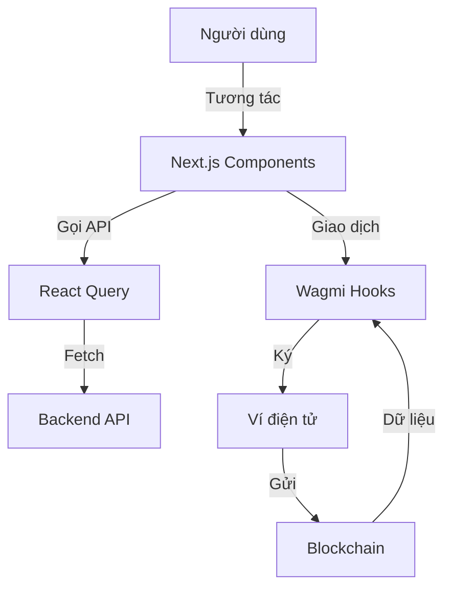

# Tổng Quan Chi Tiết Frontend Stack - Dự Án Biddee

Tài liệu này mô tả chi tiết về ngăn xếp công nghệ (stack), kiến trúc và các thư viện hỗ trợ phía giao diện người dùng (Frontend) của nền tảng đấu giá.

---

## 1. Bản Đồ Vai Trò Các Thành Phần (Frontend Stack Overview)

| Thành phần | Công nghệ | Vai trò chính |
| :--- | :--- | :--- |
| **Framework** | Next.js (App Router) | Khung làm việc chính, hỗ trợ SSR, Routing và tối ưu hóa hiệu năng |
| **Thư viện UI** | React 19 | Xây dựng giao diện dựa trên thành phần (Components) |
| **Styling** | Tailwind CSS 4 | Hệ thống CSS utility-first giúp thiết kế nhanh và nhất quán |
| **Quản lý Trạng thái** | Zustand | Quản lý trạng thái ứng dụng toàn cục (Global State) |
| **Server State** | TanStack React Query v5 | Quản lý việc đồng bộ, caching và cập nhật dữ liệu từ API |
| **Blockchain Connect** | RainbowKit + Wagmi | Cung cấp giao diện kết nối ví và các hooks tương tác blockchain |
| **Blockchain Logic** | Viem | Thư viện cấp thấp để tương tác với các node Ethereum (thay thế Ethers.js) |
| **Form & Validation** | React Hook Form + Zod | Xử lý biểu mẫu và kiểm tra dữ liệu đầu vào |
| **Đa ngôn ngữ** | next-intl | Hỗ trợ hiển thị ứng dụng với nhiều ngôn ngữ khác nhau |

---

## 2. Chi Tiết Các Công Nghệ Trọng Yếu

### A. Next.js & React 19
- **Lý do**: Tận dụng các tính năng mới nhất như Server Components để tăng tốc độ tải trang đầu tiên và SEO.
- **Vai trò**: Quản lý toàn bộ cấu trúc trang web, từ trang chủ, trang khám phá đến trang quản trị.

### B. Ngăn xếp Web3 (RainbowKit, Wagmi, Viem)
- **Lý do**: Đây là bộ công cụ mạnh mẽ và ổn định nhất cho dApp hiện nay. RainbowKit cung cấp UI kết nối ví chuyên nghiệp, Wagmi cung cấp các hooks React dễ dùng, và Viem đảm bảo hiệu năng cao.
- **Vai trò**: Cho phép người dùng kết nối ví (MetaMask, Coinbase, v.v.), ký giao dịch đấu giá, và đọc dữ liệu trực tiếp từ Smart Contract.

### C. Tailwind CSS 4 & Framer Motion
- **Lý do**: Tailwind CSS giúp tùy biến giao diện linh hoạt. Framer Motion tạo ra các hiệu ứng chuyển cảnh và tương tác mượt mà, giúp dApp cảm giác "sống động" hơn.
- **Vai trò**: Tạo nên vẻ ngoài hiện đại, tương thích tốt với mọi thiết bị (Responsive) và tăng trải nghiệm người dùng.

### D. Zustand & React Query
- **Lý do**: Phân tách rõ ràng giữa trạng thái cục bộ (như đóng/mở modal) và trạng thái từ máy chủ (danh sách đấu giá). React Query giúp giảm số lượng request lên server nhờ cơ chế caching thông minh.
- **Vai trò**: Đảm bảo dữ liệu trên màn hình luôn đồng bộ với Backend và Blockchain mà không gây giật lag.

---

## 3. Kiến Trúc Thư Mục (Source Structure)

- `src/app/`: Chứa các trang (pages) và layouts theo chuẩn App Router.
- `src/components/`: Các thành phần giao diện dùng chung (Button, Card, Modal...).
- `src/features/`: Chứa logic nghiệp vụ theo từng tính năng (Auction, Auth, KYC...).
- `src/hooks/`: Các custom hooks để tái sử dụng logic.
- `src/services/`: Chứa các hàm gọi API (Axios).
- `src/store/`: Các store Zustand để quản lý trạng thái toàn cục.
- `src/types/`: Định nghĩa các kiểu dữ liệu TypeScript.

---

## 4. Luồng Hoạt Động Frontend

